# THE HOME WEB - Controle de Orçamentos

# **Projeto em Desenvolvimento**

# Onde o projeto web está armazenado ?
- AmazonS3 

# Onde o projeto backend  está armazenado ?
- Amazon EC2

# Publicando no AmazonS3
- Entre na pasta raiz do projeto angular e execute o comando "ng build" para fazer o buil da aplicação (será gerada  pasta dist)
- Procure pelo serviço S3 e clique em Create Bucket
- 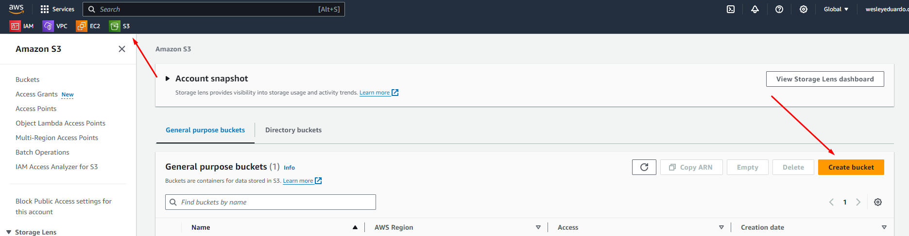
- Insira um nome para o bucket
- 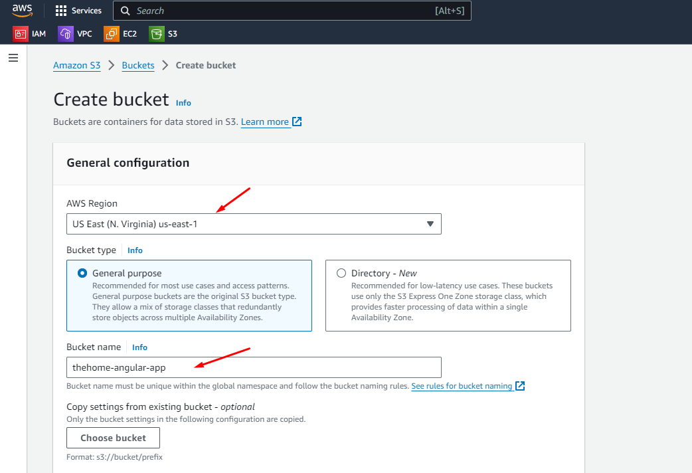
- Deixe as outras configurações como padrão e clique em Create Bucket 
- 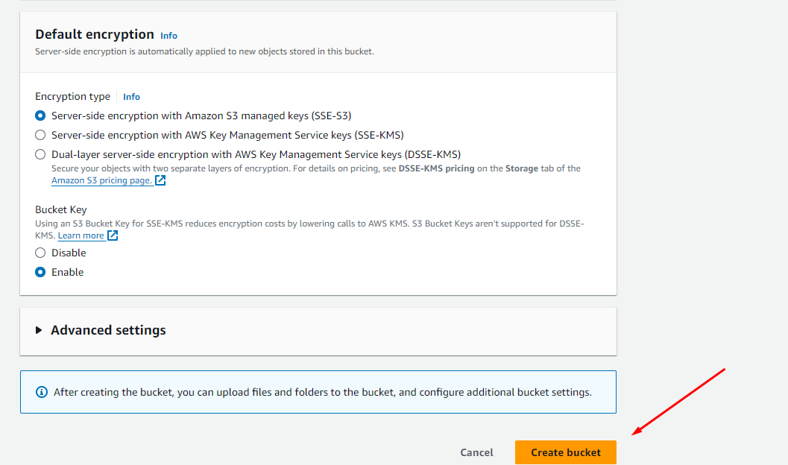
- Após a criação será mostrado na lista de buckets
- 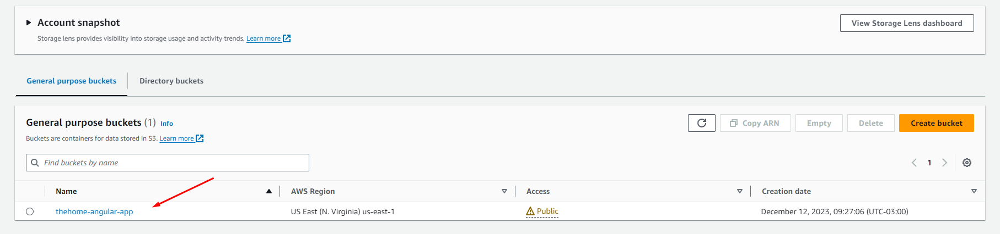
- Entre no bucket criado e faça upload de todos os arquivos dentro de pasta dist que foi gerada com o comando ng build
- 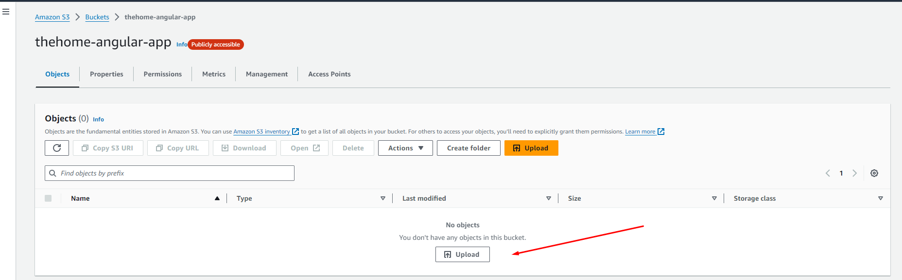
- 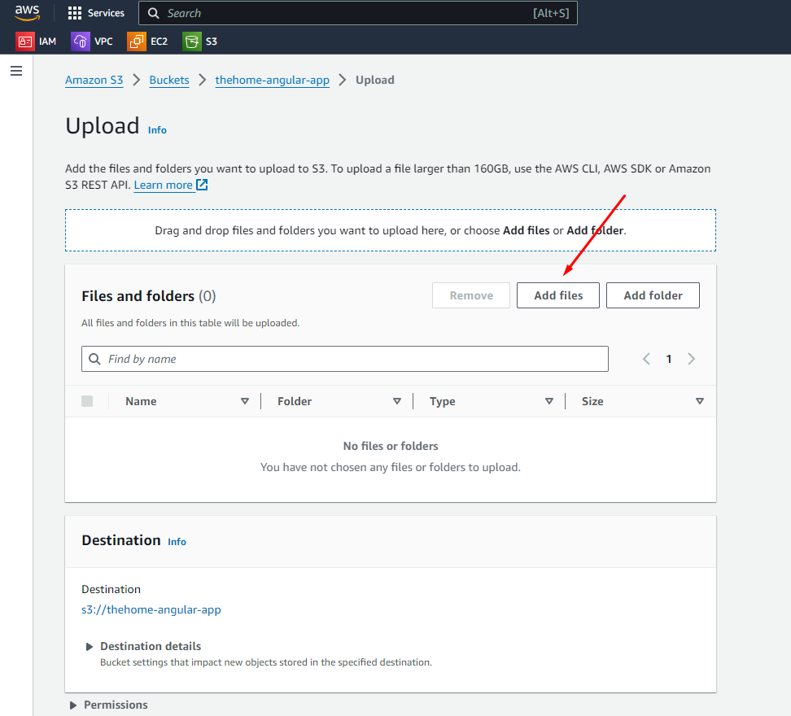
- 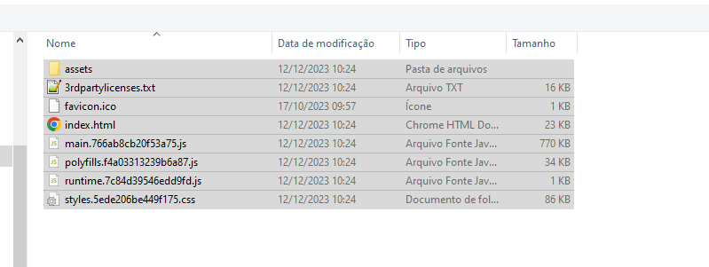
- 
- 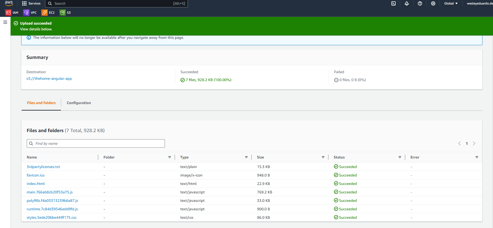
- Entre Properties > Static website hosting > Edit
- 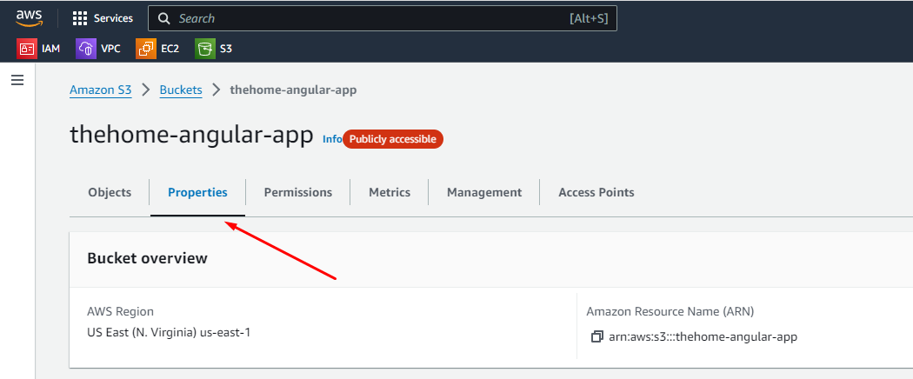
- Na página de edição, selecione enable para habilitar a hospedagem de sites estáticos. Preencha index.html nos campos Index e Error document e salve as alterações.
- 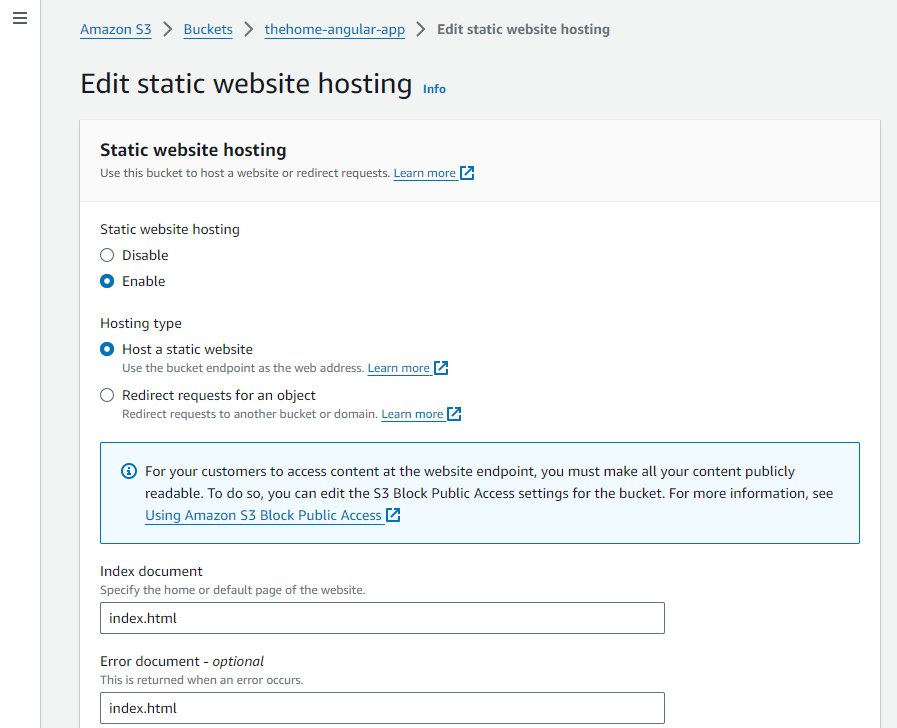
- Ao voltar na aba properties, uma URL terá sido criada:
- 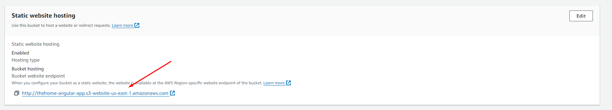
- Porém, ao tentar acessar, você verá a seguinte mensagem:
- 
- Isso acontece porque todos os buckets são privados por padrão, tornando-os inacessíveis.
- Para alterar isso, ainda no Bucket, vamos precisar ir na aba Permissions > Block public access > Edit.
- 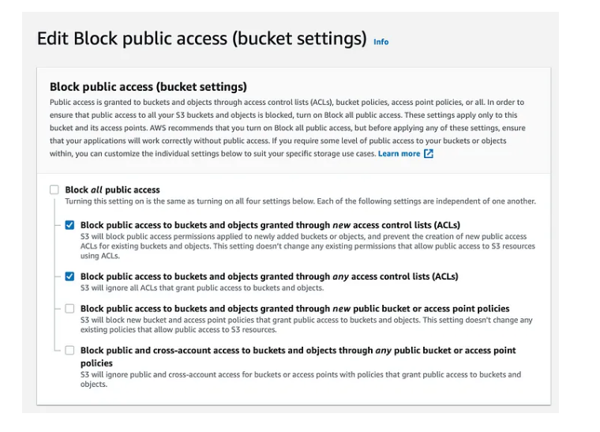
- Nessa tela, desmarcamos a opção Block all public access e deixamos marcado somente as opções
- Além disso, vamos precisar criar uma policy para garantir acesso anônimo para que os usuários possam acessar o bucket. Ainda na aba Permissions, vá em Bucket policy > Edit. Cole o conteúdo abaixo, substituindo a tag pelo nome do seu bucket:
- {
  "Version": "2012-10-17",
  "Statement": [
  {
  "Sid": "AllowPublicAccess",
  "Effect": "Allow",
  "Principal": "*",
  "Action": "s3:GetObject",
  "Resource": "arn:aws:s3:::thehome-angular-app/*"
  }
  ]
  }
- 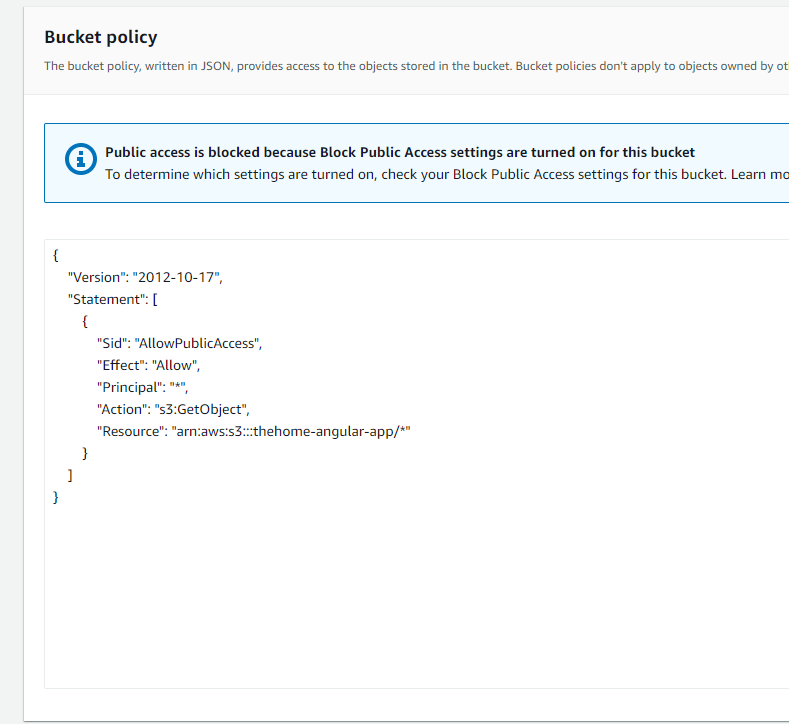
- Para acessar a lista de clientes para testar informe http://thehome-angular-app.s3-website-us-east-1.amazonaws.com/clients

# Geração da imagem da aplicação
- Geração da imagem: docker build -t wesleyeduardodev/thehome-angular .
- Execução do container: docker run -p 4200:4200 --name thehome-angular wesleyeduardodev/thehome-angular

# LINKS GERAIS
- Aplicação Backend Spring: http://ec2-3-235-17-192.compute-1.amazonaws.com
- Swagger: http://ec2-3-235-17-192.compute-1.amazonaws.com/thehome-api/swagger-ui/index.html

# Instação do Projeto
- Instalar o nodeJs: https://nodejs.org/en. Versão usada para executar o projeto: 18.18.2
- Verificar versão npm: npm -version
- Intalar Angular CLI: npm install -g @angular/cli

# Dados comando ng version
Angular CLI: 16.2.7
Node: 18.18.2
Package Manager: npm 9.8.1

# ThehomeWeb

- Antes de executar o projeto executar o comando npm install, para instalar as dependências
- This project was generated with [Angular CLI](https://github.com/angular/angular-cli) version 16.1.6.

## Development server

- Run `ng serve` for a dev server. Navigate to `http://localhost:4200/`. The application will automatically - reload if you change any of the source files.

## Code scaffolding

- Run `ng generate component component-name` to generate a new component. You can also use `ng generate directive|pipe|service|class|guard|interface|enum|module`.

## Build

- Run `ng build` to build the project. The build artifacts will be stored in the `dist/` directory.

## Running unit tests

- Run `ng test` to execute the unit tests via [Karma](https://karma-runner.github.io).

## Running end-to-end tests

- Run `ng e2e` to execute the end-to-end tests via a platform of your choice. To use this command, you need to first add a package that implements end-to-end testing capabilities.

## Further help

- To get more help on the Angular CLI use `ng help` or go check out the [Angular CLI Overview and Command Reference](https://angular.io/cli) page.
